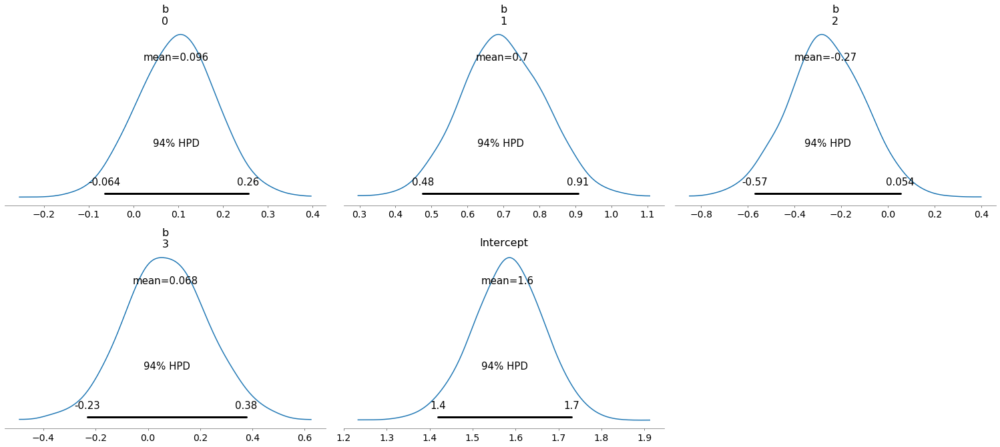

# pybrms 
> a pythonic interface for R's brms


brms is a fantastic R package that allows users to fit many kinds of Bayesian regression models - linear models, GLMs, survival analysis, etc - all in a multilevel context. Models are concisely specified using R's formula syntax, and the corresponding Stan program and data are automatically generated.

pybrms aims to bring the ease-of-use of brms to python users; more sampling, less index-gymnastics and shape errors.

## Install

Install via pip:

`pip install pybrms`

This installs the python package along with its pythonic dependencies; when you first call `pybrms`, it'll install `brms` and its dependencies. Don't worry if you don't have R or brms installed - they will be installed in your current virtual environment.

## Example 

Let's use pybrms to fit a poisson regression model, including an interaction term and by-patient varying intercept. `pybrms` can import all datasets that are included in `brms`:

```python
epilepsy = pybrms.get_brms_data("epilepsy")
```

Fitting the model is as simple as it is in `brms`:

```python
model = pybrms.fit(
    formula = "count ~ zAge + zBase * Trt + (1 | patient)",
    data = epilepsy, 
    family = "poisson"
)
```

    INFO:pystan:COMPILING THE C++ CODE FOR MODEL anon_model_6f531b7e8a9bc73464e98930b52f4547 NOW.


The user can also specify a list of priors, a `family` argument (is it a gaussian regression, binomial, poisson, etc), and optional `pystan` arguments like the number of chains, samples, etc. 

When sampling is completed, `fit` returns a `pystan` `StanFit4Model` object. The generated stan code is also available:

```python
model.get_stanmodel().show()
```

    StanModel object 'anon_model_6f531b7e8a9bc73464e98930b52f4547' coded as follows:
    // generated with brms 2.10.5
    functions {
    }
    data {
      int<lower=1> N;  // number of observations
      int Y[N];  // response variable
      int<lower=1> K;  // number of population-level effects
      matrix[N, K] X;  // population-level design matrix
      // data for group-level effects of ID 1
      int<lower=1> N_1;  // number of grouping levels
      int<lower=1> M_1;  // number of coefficients per level
      int<lower=1> J_1[N];  // grouping indicator per observation
      // group-level predictor values
      vector[N] Z_1_1;
      int prior_only;  // should the likelihood be ignored?
    }
    transformed data {
      int Kc = K - 1;
      matrix[N, Kc] Xc;  // centered version of X without an intercept
      vector[Kc] means_X;  // column means of X before centering
      for (i in 2:K) {
        means_X[i - 1] = mean(X[, i]);
        Xc[, i - 1] = X[, i] - means_X[i - 1];
      }
    }
    parameters {
      vector[Kc] b;  // population-level effects
      // temporary intercept for centered predictors
      real Intercept;
      vector<lower=0>[M_1] sd_1;  // group-level standard deviations
      // standardized group-level effects
      vector[N_1] z_1[M_1];
    }
    transformed parameters {
      // actual group-level effects
      vector[N_1] r_1_1 = (sd_1[1] * (z_1[1]));
    }
    model {
      // initialize linear predictor term
      vector[N] mu = Intercept + Xc * b;
      for (n in 1:N) {
        // add more terms to the linear predictor
        mu[n] += r_1_1[J_1[n]] * Z_1_1[n];
      }
      // priors including all constants
      target += student_t_lpdf(Intercept | 3, 1, 10);
      target += student_t_lpdf(sd_1 | 3, 0, 10)
        - 1 * student_t_lccdf(0 | 3, 0, 10);
      target += normal_lpdf(z_1[1] | 0, 1);
      // likelihood including all constants
      if (!prior_only) {
        target += poisson_log_lpmf(Y | mu);
      }
    }
    generated quantities {
      // actual population-level intercept
      real b_Intercept = Intercept - dot_product(means_X, b);
    }
    


## How it works

Behind the scene, `pybrms` calls `brms` via `rpy2`, handling the python-to-R-objects transitions in both directions and making sure that Stan gets the dtypes it expects by parsing the model's data block. 

More specifically, `pybrms` calls two `brms` functions: `make_stancode` and `make_standata`, which are used to generate the appropriate model code, design matrices, etc. These are then "pulled back" to python and fed into `pystan`.

## Adding priors

By defaults, `brms` uses non- or weakly-informative priors on model parameters. You can specify more informative priors using the following syntax:

```python
model = pybrms.fit("count ~ zAge + zBase * Trt + (1|patient) + (1|obs)",
                                           data = epilepsy, family = "poisson",
                                           priors = [("student_t(5,0,10)", "b"),
                                                     ("cauchy(0,2)", "sd")]
                                          )
```

    INFO:pystan:COMPILING THE C++ CODE FOR MODEL anon_model_3b2730a3196dc4b804b959d98397ba09 NOW.


Priors are passed as a list of tuples that conform to `brms` `set_prior` order of arguments - the first element is a Stan distribution, second is the class (b, Intercept, sd), third is coef, etc.

## Error handling

Error handling happens at the `rpy2` level, which catches the (R) error and displays it as a python `RRuntimeError` exception:

```python
model = pybrms.fit("count_typo ~ zAge + zBase * Trt + (1|patient) + (1|obs)",
                                           data = epilepsy, family = "poisson",
                                           priors = [("student_t(5,0,10)", "b"),
                                                     ("cauchy(0,2)", "sd")]
                                          )
```

    WARNING:rpy2.rinterface_lib.callbacks:R[write to console]: Error: The following variables are missing in 'data':
    'count_typo'
    


    ---------------------------------------------------------------------------

    RRuntimeError                             Traceback (most recent call last)

    <ipython-input-6-3103bec4b060> in <module>
          2                                            data = epilepsy, family = "poisson",
          3                                            priors = [("student_t(5,0,10)", "b"),
    ----> 4                                                      ("cauchy(0,2)", "sd")]
          5                                           )


    ~/projects/pybrms/pybrms/pybrms.py in fit(formula, data, priors, family, sample_prior, sample, **pystan_args)
        128         family=family,
        129         priors=brms_prior,
    --> 130         sample_prior=sample_prior,
        131     )
        132     model_data = _convert_R_to_python(formula, data, family)


    ~/projects/pybrms/pybrms/pybrms.py in get_stan_code(formula, data, priors, family, sample_prior)
         54     if len(priors)>0:
         55         return brms.make_stancode(
    ---> 56             formula=formula, data=data, prior=priors, family=family, sample_prior=sample_prior
         57         )[0]
         58     else:


    ~/miniconda3/envs/rpy/lib/python3.6/site-packages/rpy2/robjects/functions.py in __call__(self, *args, **kwargs)
        190                 kwargs[r_k] = v
        191         return (super(SignatureTranslatedFunction, self)
    --> 192                 .__call__(*args, **kwargs))
        193 
        194 


    ~/miniconda3/envs/rpy/lib/python3.6/site-packages/rpy2/robjects/functions.py in __call__(self, *args, **kwargs)
        119             else:
        120                 new_kwargs[k] = conversion.py2rpy(v)
    --> 121         res = super(Function, self).__call__(*new_args, **new_kwargs)
        122         res = conversion.rpy2py(res)
        123         return res


    ~/miniconda3/envs/rpy/lib/python3.6/site-packages/rpy2/rinterface_lib/conversion.py in _(*args, **kwargs)
         26 def _cdata_res_to_rinterface(function):
         27     def _(*args, **kwargs):
    ---> 28         cdata = function(*args, **kwargs)
         29         # TODO: test cdata is of the expected CType
         30         return _cdata_to_rinterface(cdata)


    ~/miniconda3/envs/rpy/lib/python3.6/site-packages/rpy2/rinterface.py in __call__(self, *args, **kwargs)
        783                     error_occured))
        784             if error_occured[0]:
    --> 785                 raise embedded.RRuntimeError(_rinterface._geterrmessage())
        786         return res
        787 


    RRuntimeError: Error: The following variables are missing in 'data':
    'count_typo'


This makes sure you can debug your data/formula/etc without actually leaving python.

## Visualization

Since `pybrms` returns a `pystan` object, we can easily visualize the results using `arviz`:

```python
import arviz as az
inference_data = az.from_pystan(model)
az.plot_posterior(inference_data, var_names=['b', 'Intercept']);
```





For a more detailed walkthrough, see the accompanying [blog post](link).
